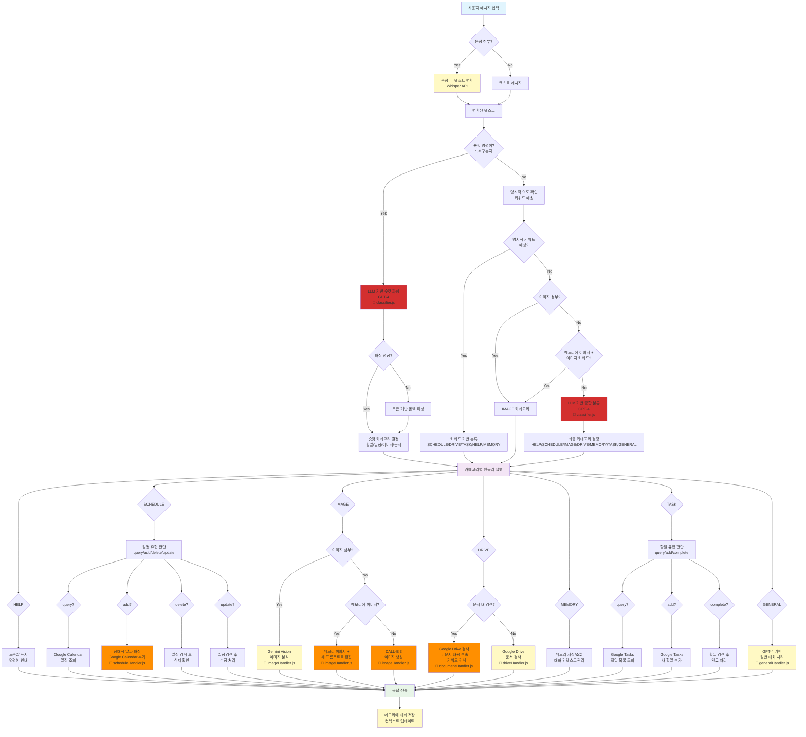

사용자의 발화 분석 워크플로우를 파악하기 위해 관련 파일들을 살펴보겠습니다. [[memory:8349730]]

[3 tools called]

이제 메시지 처리 관련 파일들을 더 살펴보겠습니다.

[3 tools called]

이제 이미지 핸들러와 문서 핸들러도 살펴보겠습니다.

[3 tools called]

이제 전체 워크플로우를 파악했습니다. 사용자 발화 분석 워크플로우의 플로우차트를 그려드리겠습니다.

[1 tool called]

코드 분석을 통해 파악한 사용자 발화 분석 워크플로우를 바탕으로 플로우차트를 작성하겠습니다.

## 사용자 발화 분석 워크플로우

분석 결과, 다음과 같은 주요 처리 단계들을 확인했습니다:

1. **메시지 전처리** (음성 → 텍스트 변환)
2. **숏컷 명령어 파싱** (최우선 처리)
3. **명시적 의도 확인** (키워드 기반)
4. **이미지 첨부 확인**
5. **메모리 기반 이미지 처리**
6. **LLM 기반 분류**
7. **카테고리별 핸들러 실행**

[1 tool called]

이제 분석한 내용을 바탕으로 플로우차트를 그려드리겠습니다:

[1 tool called]

첨부해주신 이미지와 유사한 형태로 현재 프로젝트의 **사용자 발화 분석 워크플로우**를 플로우차트로 작성했습니다.

## 주요 특징

### 1. **다단계 분류 시스템**
- **1차**: 숏컷 명령어 파싱 (`:`, `#` 구분자 기반)
- **2차**: 명시적 키워드 매칭
- **3차**: 이미지 첨부/메모리 확인
- **4차**: LLM 기반 종합 분류

### 2. **LLM 활용 지점**
- **숏컷 파싱**: GPT-4로 복잡한 숏컷 명령어 해석
- **최종 분류**: 명시적 패턴이 없을 때 GPT-4로 의도 분석
- **각 핸들러**: 카테고리별로 특화된 LLM 처리

### 3. **7가지 주요 카테고리**
- **HELP**: 도움말 요청
- **SCHEDULE**: 일정 관리 (Google Calendar)
- **IMAGE**: 이미지 생성/분석 (DALL-E 3, Gemini Vision)
- **DRIVE**: 문서 검색/요약 (Google Drive)
- **MEMORY**: 대화 기억/조회
- **TASK**: 할일 관리 (Google Tasks)
- **GENERAL**: 일반 대화

### 4. **통합된 처리 흐름**
각 카테고리는 세부 액션으로 분기되어 Google API나 AI 서비스와 연동되며, 최종적으로 메모리에 대화 컨텍스트가 저장되어 다음 대화에 활용됩니다.

이 워크플로우는 사용자의 다양한 의도를 정확히 파악하고 적절한 서비스로 라우팅하는 지능형 봇의 핵심 구조를 보여줍니다.

## LLM 프롬프트 복잡도 분석

### 🔴 고복잡도 프롬프트 (2000+ 글자)

| 노드 | 기능 | 프롬프트 길이 | 주요 특징 |
|------|------|---------------|-----------|
| **G** | LLM 기반 숏컷 파싱 | ~2500자 | • 4개 카테고리 (할일/일정/이미지/문서) • 복잡한 시간 표현 인식 • 유연한 파라미터 순서 처리 • JSON 응답 형식 지정 |
| **Q** | LLM 기반 종합 분류 | ~2000자 | • 7개 주요 카테고리 분류 • 컨텍스트 기반 의도 분석 • 추출 규칙 및 예시 포함 • 구조화된 응답 형식 |

### 🟠 중복잡도 프롬프트 (600-1200 글자)

| 노드 | 기능 | 프롬프트 길이 | 주요 특징 |
|------|------|---------------|-----------|
| **U7** | 상대적 날짜 파싱 | ~1200자 | • 한국어 시간 표현 해석 • 복잡한 주/일 계산 규칙 • 종일/시간 지정 일정 구분 • 지속시간 자동 계산 |
| **V4** | 메모리 이미지 편집 | ~900자 | • 원본 주체 보존 규칙 • 상호작용 파트너 추가 • 환경/스타일 변경 처리 • 상세한 수정 지침 |
| **V5** | DALL-E 3 이미지 생성 | ~800자 | • 사실적 사진 스타일 강조 • 대화 컨텍스트 활용 • 창의적 장면 구성 • 전문 사진 용어 사용 |
| **W2** | 문서 요약 및 분석 | ~600자 | • 문서 용도 추측 • 구조화된 요약 형식 • 핵심 포인트 추출 • 전문적 톤 유지 |

### 🟡 저복잡도 프롬프트 (200자 이하)

| 노드 | 기능 | 프롬프트 길이 | 주요 특징 |
|------|------|---------------|-----------|
| **C** | 음성 → 텍스트 변환 | API 직접 호출 | • Whisper API 단순 호출 • 별도 프롬프트 없음 |
| **V2** | Gemini Vision 이미지 분석 | ~100자 | • 기본 이미지 해석 • 단순 질의응답 형식 |
| **W3** | Google Drive 문서 검색 | API 직접 호출 | • Drive API 검색 쿼리 • 별도 프롬프트 없음 |
| **Z1** | GPT-4 기반 일반 대화 | ~200자 | • 기본 대화 어시스턴트 • 간단한 컨텍스트 포함 • 한국어 응답 지정 |

### 프롬프트 설계 패턴

1. **구조화된 지침**: 모든 고복잡도 프롬프트는 명확한 섹션 구분 사용
2. **예시 기반 학습**: 복잡한 작업에는 다양한 예시 제공
3. **한국어 특화**: 한국어 시간 표현, 문화적 맥락 고려
4. **JSON 응답 강제**: 구조화된 데이터 추출을 위한 형식 지정
5. **컨텍스트 활용**: 대화 기록 및 사용자 메모리 정보 포함